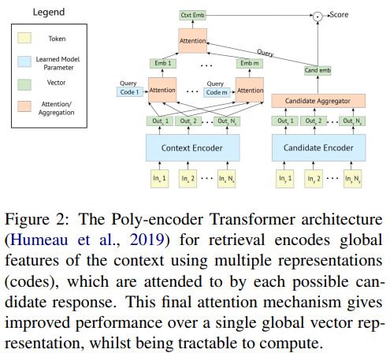

import Comment from '@contents/components/Comment';

[Recipes for building an open-domain chatbot](https://arxiv.org/pdf/2004.13637.pdf) 논문을 바탕으로 작성하였습니다.

# Introduction

우리는 사람이 보기에 훌륭한 open-domain chabot을 만드는 레시피를 제공합니다.
단순하게 모델의 크기를 늘리는 것을 넘어 우리는 두 가지 부분에서 연구를 진행어요.

* Blending Skills  
우리는 모델이 개성, 매력, 지식, 공감에 대해 초점을 맞추는 작업을 선택했습니다.
`BST(Blended Skill Talk)`를 이용하여 좋은 성과를 달성하였는데,
이는 training data와 initial conversational context(페르소나, 주제와 같은)를 제공하므로 개성, 매력, 지식, 공감을 타겟하도록 합니다.
`BST`를 사용하는 작은 모델이 그렇지 않은 큰 모델과 비슷하거나 더 뛰어나 성능을 보여주었어요.
또한 `BST`에서 바람직한 특성을 강조하면서, 이러한 튜닝이 toxicity과 같은 바람직하지 않은 특성을 최소화하는 것을 볼 수 있었습니다.

* Generation Strategies  
동일한 모델에 서로 다른 decoding 알고리즘을 선택하는 것만으로 다른 결과를 낼 수 있습니다.
특히 응답의 길이가 사람이 판단하기에 중요하다는 것을 볼 수 있죠.
예를 들어 너무 짧은 응답은 지루하거나 관심 없어 보이고, 너무 길면 장황하고 대화에 집중하지 않는 것처럼 보입니다.
우리는 sampling에 비해 beam search가 열등하다는 연구와 다르게, 하이퍼 파라미터를 잘 조절하여 trade-off 관계에서 뛰어난 결과를 만들 수 있다고 생각해요.

사람을 통한 평가는 정확한 셋팅값에 따라 달라질 수 있다고 생각합니다.
모델 성능은 주어진 주제의 유무, 전체 대화 길이, 상대방의 선택과 같은 구체적인 지시에 영향을 받습니다.
우리는 프롬프트 없이 짧은 multi-turn conversation에서 성능을 보여드립니다.
또한 재현 가능하도록 모델과 fine-tuning을 위한 코드, 가중치등을 공개합니다.
인간 평가에서 우리의 모델이 `Meena`를 앞서는 결과를 가집니다.

이러한 성능에도 우리는 아직 open-domain conversation 문제를 전부 해결했다고 생각하지 않습니다.
그러므로 우리는 우리의 모델의 한계를 분석하고 이를 해결하려고 시도할 것입니다.
특히 <mark>자세하기 물어볼때 깊은 지식의 부족, 간단한 어휘를 사용하려는 경향, 자주 사용되는 문구를 반복하려는 경향</mark>을 가집니다. 

# Model architecture

우리는 retrieval, generative, retrieve-andrefine, 총 3가지 종류의 모델에 대해 다룰 것입니다.
위 모델들은 모두 트랜스포머를 사용합니다.

## Retriever

Retrieval system은 대화 이력(context)를 입력으로 대량의 후보지에 점수를 매겨, 가장 높은 점수의 후보를 선택하는 방식으로 다음 대화를 만들어냅니다.
우리는 `poly-encoder` architecture를 사용했습니다.
`Poly-encoder`는 multiple representation(N 코드, N은 하이퍼 파라미터)을 이용하여 context의 global feature를 인코딩합니다.
이는 각 후보 응답들에 의해 attentioned 됩니다.
여기서 마지막 attention mechanism은single global vector representation(bi-encoders) 보다 향상된 성능을 제공합니다.
또 입력과 출력을 단순히 연결하는것 보다(cross-encoder) 계산 가능합니다.
`Poly-encoder`는 많은 dialogue task에서 SOTA를 달성하였습니다.
우리는 2가지 크기(256M, 622M 파라미터)의 `poly-encoder`를 사용하였습니다.
여기서 N=64로 설정하였습니다. 

<Comment>
Poly-encoder에 대한 기본적인 지식을 알고 봐야 할듯. 내용이 잘 이해가 안감
일단 간단하게 간단하게 넘어가고 Blenderbot 2, 3에서도 poly-encoder를 사용하면 그떄 관련 논문을 읽어보자!
</Comment>

## Generator

우리는 표준 seq2seq 트랜스포머 모델을 사용하였습니다.
기본적으로 ParlAI version을 기반으로 구현하였고, 사전학습된 BPE tokenization을 사용하였습니다.
우리는 3가지 크기의(90M, 2.7B, 9.4B) 모델을 사용하였습니다.
9.4B 모델은 4개의 encoder layer, 32개의 decoder layer, 4096 dimension embedding, 그리고 32 attention heads를 가집니다.
2.7B 모델은 2개의 encoder layer, 24개의 decoder layer, 2560 dimension embedding, 그리고 32 attention heads를 가집니다.

## Retrieve and Refine

생성형 모델은 지루하고 반복적은 응답을 생성하는 문제를 가지고 있지만 모델 크기를 늘린다고 해결되지 않았습니다.
또한 hallucinate knowledge와 모델에 embedded 되지 않은 외부 지식에 대해 접근이 불가능한 문제가 있었습니다.
이러한 문제를 해결하기 위해 `retrieve and refine model`이 제시되었습니다.
우리는 dialogue retrieval, 그리고 knowledge retrieval 두 가지로 나누어 검색 단계를 고려하였습니다.

### Dialogue Retrieval

우리는 단순히 section 2.1에서 다룬 retrieval-based dialogue 모델을 사용하였습니다.
<mark>대화 이력을 이용하여 retrieval model은 먼저 응답을 생성합니다.
이를 바로 유저에게 보여주기 보다, special separator token과 함께 generator의 input sequence로 사용합니다.</mark>
Generator는 이를 이용하여 응답을 생성하는 것이죠.
Retrieval model은 인간이 작성한 발화를 생성하는데 이는 표준 generative model이 생성한 발화보다 더 사람다운 경향이 있습니다.
따라서 generator가 이러한 발화의 요소를 복사할지 아닐지 선택하도록 학습하는 것은 더 향상된 성능을 만들 것입니다.

<Comment>
Retrieval model이 기존 대화 이력을 통해 어느 정도 사람과 비슷한 발화를 내놓는데
Generator에서 이 발화에서 일부 요소를 사용할 것인지 그냥 쌩으로 지가 답을 생성할건지 결정하도록 학습한다는 소리인가?
</Comment>

### knowledge Retrieval

우리는 위와 동일한 메카니즘을 