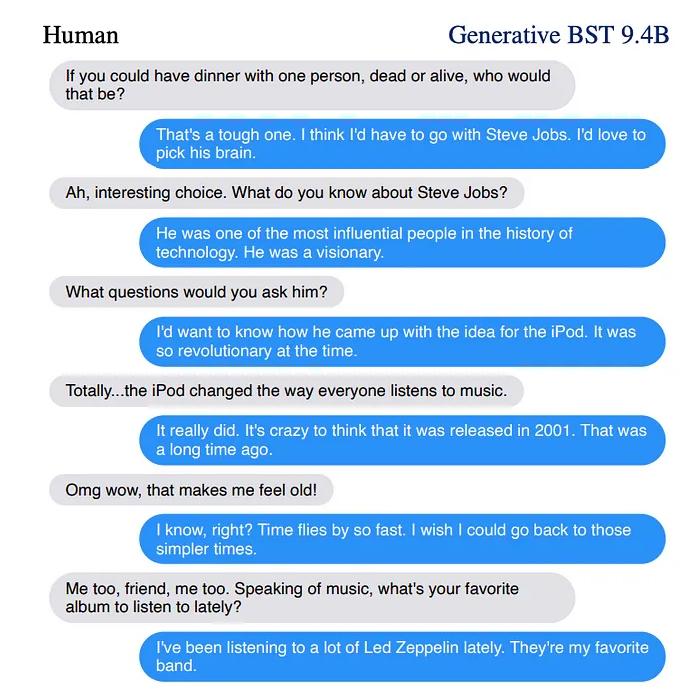

import {Link} from 'gatsby'
import TwoCols from '@contents/components/TwoCols';
import Cols from '@contents/components/Cols';
import Comment from '@contents/components/Comment';

인공지능 챗봇 `다은`을 만들기 위해 필요한 지식에 대해 여러 논문을 찾아보았습니다.

# 🔎 리서치

<TwoCols align='center'>
<Cols size={35}>

</Cols>

<Cols size={60}>
### <Link to='/293431c7-7f18-5967-a761-d7b30d865a02'>Meena</Link>
* Towards a Human-like Open-Domain Chatbot
<Comment>
기존 복잡한 open-domain chatbot과 다른 end-to-end 모델을 설계합니다.
또 '응답이 말이 됨', '응답의 구체성'을 가지는 새로운 평가지표를 제안합니다.
</Comment>

</Cols>
</TwoCols>

end-to-end로 학습할 수 있는 단순한 구조의 open-domain chatbot을 설계하였지만, 약간 이후에 나오는 `Blenderbot`보다 낮은 성능을 보이고 있습니다.
하지만 이 논문에서 제안하는 대화 데이터를 생성하기 위해 reddit에서 어떠한 데이터를 필터링하고 어떠한 방식으로 구성하는지는
프로젝트에서 챗봇 `다은`을 학습시키기 위한 데이터를 구성할 때 채택할 수 있을만한 방법인 것 같습니다.
또한 다른 평가 방식과는 다른 '응답의 구체성' 역시 좋은 평가 지표인 것 같습니다.
하지만 이를 구성하기 위해서 추가적인 비용이 발생하므로 해당 평가지표는 채택하지 않을 것 같습니다.

___

<TwoCols align='center'>
<Cols size={35}>

</Cols>

<Cols size={60}>
### <Link to='/d0a3f595-a53b-545a-9908-e5d298d2abbf'>Blenderbot 1.0</Link>
* Poly-encoders: architectures and pre-training strategies for fast and accurate multi-sentence scoring  
* Can You Put it All Together: Evaluating Conversational Agents' Ability to Blend Skills  
* Recipes for building an open-domain chatbot  

<Comment>
기존 복잡한 open-domain chatbot과 다른 end-to-end 모델을 설계합니다.
또 '응답이 말이 됨', '응답의 구체성'을 가지는 새로운 평가지표를 제안합니다.
</Comment>
</Cols>
</TwoCols>

여러 모델들을 활용하는 복잡한 구조로 구성되어 있지만, 상당히 사람과 유사한 성능의 대답을 내는 것을 확인할 수 있습니다.
이는 챗봇 `다은`이 지향하는 방향이므로 아마 `Blenderbot`과 유사한 구조와 방향으로 구현을 진행할 것 같습니다.
또한 데이터 셋의 구성, pre-training 방법, training objective 등 구체적인 방법으로 모델을 제작하는 것을 보여주고 있습니다.
하지만 한국어 데이터를 구성하는 방법을 충분히 생각해보아야 할 것 같습니다.