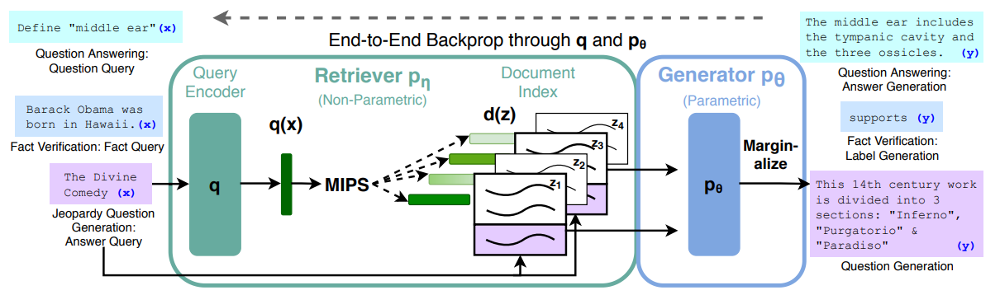

[Retrieval-Augmented Generation for Knowledge-Intensive NLP Tasks](https://arxiv.org/pdf/2005.11401.pdf) 논문을 바탕으로 작성하였습니다.

사전 학습된 언어 모델은 파라미터들을 이용하여 외부 메모리 접근 없이 지식 기반 수행 능력을 보여줍니다.
하지만 이는 지식을 업데이트 할 수 없고 hallucination을 생성하기도 하죠.
논문에서는 이를 parametric memory(seq2seq)와 non-parametric memory(retriever)를 결합하여 외부에서 query와 관련된 passage를 가져와 같이 활용하는 방식으로 해결합니다.

# RAG(Retrieval-Augmented Generation)



입력 시퀀스 $x$에 대해 검색된 문저 $z$와 생성된 시퀀스 $y$라고 합시다.
모델은 크게 두 가지 부분으로 나뉩니다.
1. Retriever $p_\eta$ : Query $x$를 이용하여 관련된 top K개의 passage 선정
2. Generator $p_\theta (y_i | x, z, y_{1:i-1})$ : query $x$, passage $z$, 이전 토큰들 $y_{1:i-1}$을 통해 다음 토큰을 생성

모델을 학습하는 방법을 보기 전에 앞서 latent variable, marginalize에 대해 알아봅시다.
우리는 동전 A, B가 있고 동전 B의 확률은 A의 영향을 받는다고 가정합시다.
```
동전 B - 앞면  | 동전 B - 뒷면
동전 A 앞 1/12 | 동전 A 앞 2/12
동전 A 뒤 3/12 | 동전 A 뒤 6/12
```
이때 우리는 동전 B의 확률에만 관심이 있다고 하면 
동전 B가 뒷면이 나올 확률 $1/12 + 3/12 = 1/3$, 앞면이 나올 확률 $2/12 + 6/12 = 2/3$입니다.
이때 동전 A를 `latent variable`, 동전 A와 관계 없이 동전 B의 확률을 구한 행동을 `marginalize`라고 합니다.  

논문에서는 두 구간을 end-to-end로 학습하기 위해 두 가지 방법으로 prediction sequence를 수행하려 합니다.
