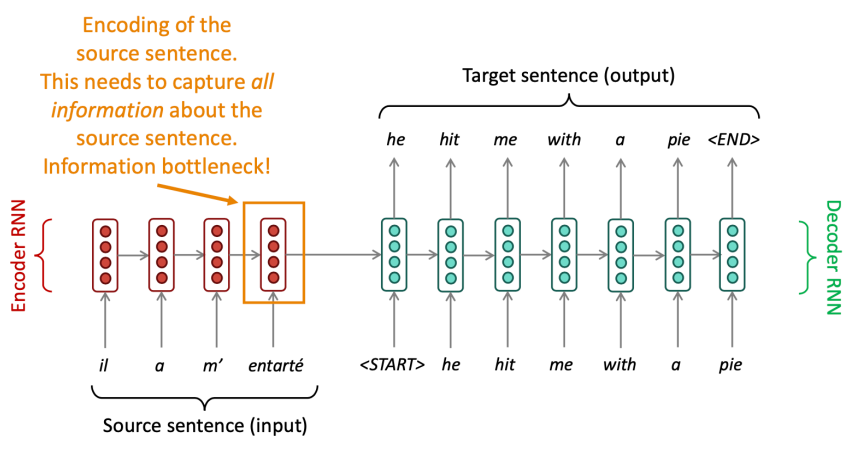
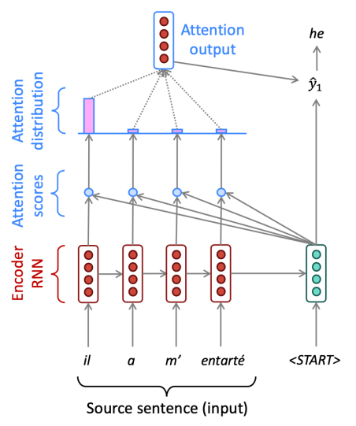

우리는 seq2seq 모델을 통해 MT 작업을 수행하는 것을 보았습니다.
그런데 여기에 한 가지 문제가 있어요.
입력의 모든 정보가 인코더의 마지막 레이어에 저장되어야 한다는 것이죠.
그로 인해 정보가 압축되는 현상이 발생해요.
이를 `bottleneck problem`이라고 합니다.

# Attention

이를 출력을 생성하는 단계에서 인코더의 모든 step에 대한 정보와 접근하여 출력을 결정하는 `attention` 메카니즘을 통해 해결했습니다.

Attention 메카니즘은 아래와 같아요.

1\. 디코더의 각 step에서 생성된 hidden state $s_t$와 인코더의 hidden state $h_N$을 이용하여 attention score $e^t$를 계산합니다.  
$$
e^t = [s_t^T h_1, \cdots, s_t^T h_N] \in \mathbb{R}^N
$$

2\. Attention score에 softmax를 적용하여 attention distribution $\alpha^t$를 구합니다.
$$
\alpha^t = softmax(e^t) \in \mathbb{R}^N
$$

3\. $\alpha^t$를 이용하여 $h_N$의 가중 합 attention output $a_t$를 구합니다.
$$
a_t = \sum_{i=1}^{N} \alpha_i^t h_i \in \mathbb{R}^h
$$

4\. Attention output $a_t$와 $s_t$를 합친 후 기존 seq2seq 모델처럼 연산을 진행합니다.
$$
[a_t; s_t] \in \mathbb{R}^{2h}
$$

Attention은 디코더를 source의 어떠한 부분에 집중할 수 있도록 하여 NMT의 성능을 크게 높였습니다.
이전 정보를 기억하기보다 번역시 다시 source 정보를 되돌아보며 더욱 사람과 같은 형태를 띄게 되었네요.
또 attention은 bottleneck problem과 vanishing gradient problem을 해결할 수 있었어요.
Attention distribution을 이용하면 디코더가 어느 부분에 집중하는지 알 수 있어서 더욱 해석가능한 모델이 되었어요.
우리가 어디를 보라고 알려준 것도 아닌데 말이죠!

사실 attention score를 계산하는 방법을 여러 가지가 있어요.
* Basic dot-product attention: 위에서 사용한 방식이죠. $e_i = s^T h_i \in  \mathbb{R}$
* Multiplicative attention: 앞선 방식에 weight를 추가한 방법이에요. $e_i = s^T W h_i \in  \mathbb{R}$
* Reduced-rank Multiplicative attention: 트랜스포머의 self-attention에서 사용하는 방식입니다. $e_i = s^T(U^T V)h_i = (Us)^T(Vh_i)$
* Additive attention: $e_i = v^T \tanh (W_1 h_i + W_2 s) \in \mathbb{R}$

우리는 seq2seq 모델의 성능 향상을 위해 attention을 사용하였지만, 사실 attention은 거의 모든 아키텍처에 적용이 가능합니다.
attention의 더 일반적인 정의는 query, value 벡터가 주어지고 query에 따른 value의 가중 합을 계산하는 기술이에요.
즉, query가 어느 value를 집중해서 볼 것인지 선택해서 합치는 방식이죠.

# From RNN to Attention-Based NLP Models