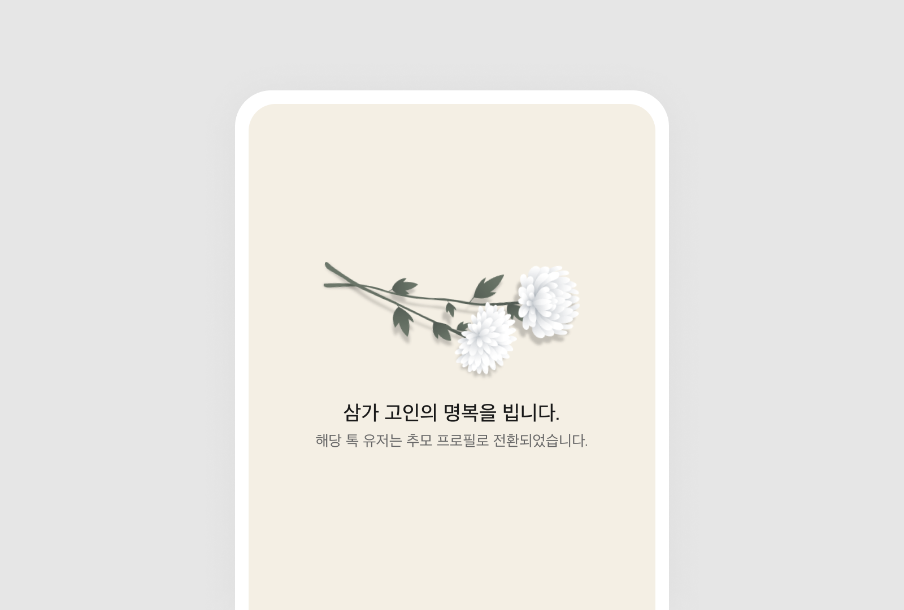

import * as Elem from '@elements';

이번에 SK AI Challenger 프로그램을 이수하며 팀 프로젝트를 진행하게 되었습니다.
시험으로 첫주에 출석하지 못한 인원끼리 모여 팀 `🐣오리알`을 구성했어요.

# 아이디어

각 인원들이 생각해낸 아이디어와 앞서 기술 스택을 바탕으로 개발 가능한 주제로 줄인 결과 3가지 후보가 만들어졌습니다.

## 😀 이모티콘 생성기

이미지 생성형 모델을 활용하여 메신저에서 본인이 원하는 이모티콘을 직접 제작해서 사용하는 서비스입니다.
대화의 흐름에 적절한 본인만의 이모티콘을 편리한 접근성을 활용하여 생성, 전송하는 것이죠.

하지만 이는 <Elem.ColorText color='var(--error)'>기존의 이모티콘을 사용하여 학습을 진행한다는 부분에서 저작권에 관한 문제가 발생할 수 있다는 문제가 있었습니다.</Elem.ColorText>
또한 조사한 결과 ['카카오톡에서 생성형 AI로 만든 이모티콘 입점을 제한'](https://www.hani.co.kr/arti/economy/economy_general/1108067.html)한다는 기사를 찾을 수 있었죠.
아직은 <Elem.ColorText color='var(--error)'>생성형 AI으로 제작된 이모티콘을 비즈니스 모델로 사용하는 것은 시기상조</Elem.ColorText>인듯 하였습니다.

> 개인적으로 이런 서비스가 존재한다면 이용할 의사가 있었는데 정말 아쉽습니다.

## 🚬 지정 외 장소 흡연 감지기

흡연구역이 아닌 장소에서 흡연을 하는 인원을 감지하는 시스템입니다.
드론을 활용하여 흡연을 하는 사람을 촬영하고 얼굴을 인식하는 방식이죠.
흡연구역이 아닌 장소에서 흡연을 하여 주변 건물에 위치한 사람에게 피해를 주는 것을 방지하기 위해 기획되었어요.

이는 배터리와 기상에 영향을 받는 드론 대신 CCTV를 활용하여 24시간 감지 가능하도록 개선할 수 있을 것 같습니다.
또한 흡연 행위로 한정하는 것이 아닌 범법 행위 중 데이터 구축과 정밀한 정확도를 가지도록 학습하기 쉬운 특정한 행위로 타겟할 수 있을 것 같았어요.

## 🕊️ 온라인 추모관

죽음으로 인해 누군가를 잃었을때 그 사람을 그리워하며 이전에 촬영된 영상을 보고는 합니다.
그리운 마음을 조금이라도 해소하기 위해 그 사람과 대화를 할 수 있는 서비스입니다.

당사자의 성격과 유사한 응답을 생성하고 이에 당사자의 음성을 입혀 그 사람과 대화하는 느낌이 들도록 서비스를 제공합니다.
기존의 존재하는 음성 합성 AI와 페르소나를 적용한 ChatBot을 이용하여 구현할 수 있을 것 같았어요.
다만 우려되는 사항은 <Elem.ColorText color='var(--error)'>고인에 대한 AI 모델을 생성한다는 비판적인 시선</Elem.ColorText>이었습니다.

# 선정

과거에 돌아가신 박윤배 배우를 AI 기술을 통해 현재 사람들과 대화를 할 수 있게 방송국에서 기획한 프로그램이 있었습니다.
해당 영상의 댓글을 보니 가까운 이의 죽음을 경험한 사람은 이러한 방식으로도 만나고 싶어 한다는 것을 확인할 수 있었죠.  

`youtube: https://www.youtube.com/watch?v=aqgC9DHieb8&ab_channel=tvNDENT`
`AI 기술로 다시 가족들을 만날 수 있다면..😢 너무 듣고 싶었던 응삼이 故 박윤배의 목소리로 전원일기 식구들과 대화를 나누다`

또한 카카오톡에서 고인에 대한 계정을 바로 삭제하는 것이 아닌, 프로필을 남겨 지인들이 그 사실을 알게 하고 추모하는 시간을 만들어 주는 서비스를 실행하였습니다.

또한 조금 더 도전적인 난이도로 더 큰 성장을 할 수 있는 `🕊️ 온라인 추모관`을 주제로 프로젝트를 진행하기로 하였습니다.
