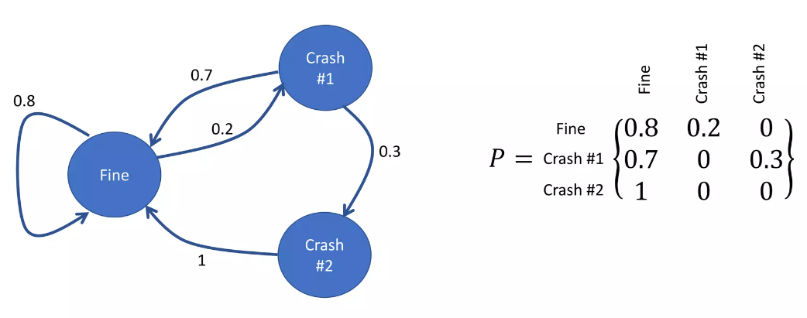
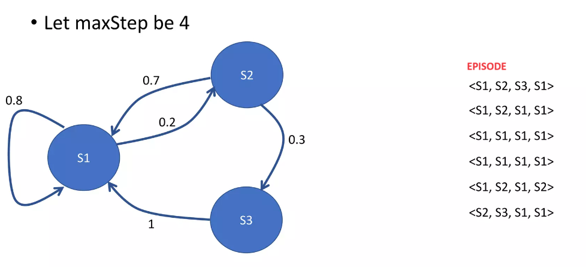
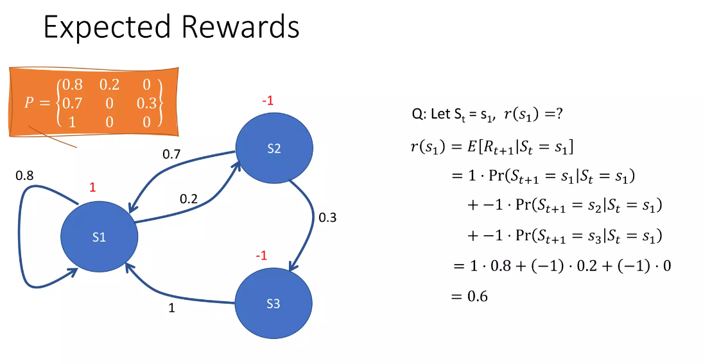
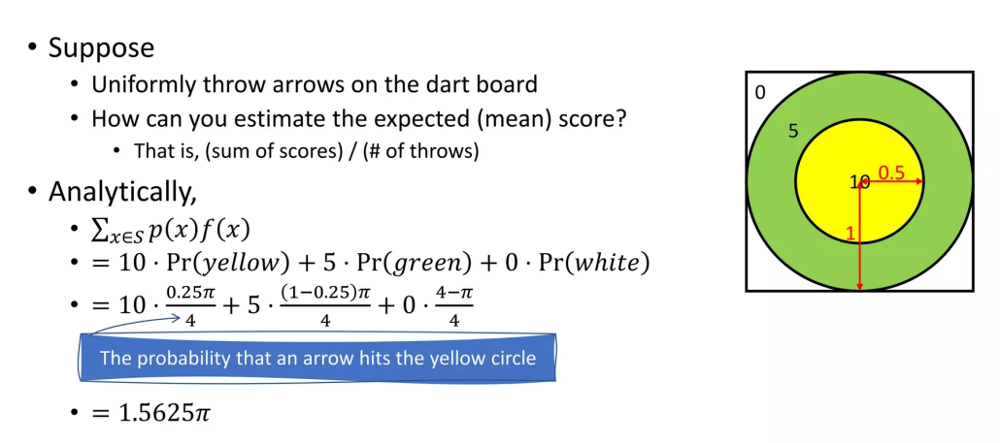

import TwoCols from '@contents/components/TwoCols';
import Cols from '@contents/components/Cols';

`강화학습(Reinforcement Learning)`은 Agent가 시행착오를 통해 보상을 극대화 하는 방식으로 학습하는 것입니다.
무작위로 여러 행동을 하고 각 행동에 대한 보상을 주어 바람직한 행동을 강화하고, 좋지 않은 행동에 패널티를 부여하는 방식이죠.
Agent는 누적 보상(Return)을 극대화하는 방향으로 학습합니다.

# 용어 정리

<TwoCols>
<Cols size={50}>

* Agent  
강화학습에서 의사 결정을 수행하는 주체입니다.

* State & Observation  
Agent가 다음 행동을 선택하기 위해 사용하는 현재 상태에 대한 모든 정보를 말합니다.
Observation은 State의 부분 집합으로 현재 상태에서 일부 정보만을 가질 수 있죠.
State의 모든 환경을 관찰할 수 있을 때를 `Fully Observed`, 일부 환경만을 관찰할 수 있을 때를 `Partially Observed`라고 하죠.

* Action  
Agent의 행동을 의미합니다.
이때 가능한 모든 행동을 `Action Space`라고 하죠.
오목, 바둑과 같은 Action Space가 한정된 경우를 `Discrete Action Space`, 로봇의 속력이나 움직임과 같은 무한한 경우를 `Continuous Action Space`라고 하죠.

</Cols>
<Cols size={50}>
* Policy  
Agent가 다음 행동을 계산하는 함수입니다.
어떠한 Action을 취할지 선택하는 것이죠.

* Trajectory(Episode)  
State와 Action의 Sequence를 나타냅니다.

$$
\tau = (s_0, a_0, s_1, a_1, \cdots)
$$

* Reward  
즉각적인 관점에서 얼마나 좋은지 평가하는 지표입니다.
이는 현재 상태, 가장 최근의 액션, 다음 상태에 의해 계산되죠.
$$
r_t = R(s_t, a_t, s_{t+1})
$$

* Value Function(Return)  
어떤 상태나 행동이 장기적으로 얼마나 좋은지 평가하기 위한 함수입니다.
이는 기하급수적으로 감소하는 가중치를 가진 Reward의 합으로 계산합니다.
$$
R(\tau) = \sum_{t=0}^{T} \gamma^{t} r_t (0 < \gamma < 1>) \\
$$

</Cols>
</TwoCols>

# MDP(Markov Desicion Process)

위 그림과 같이 $i$에서 $j$로 가는 State Transition Matrix $P = p_{ij}$로 정의합니다.
이는 파라미터가 아닌 주어지는 값, 상수이죠. 

어떠한 상태에서 시작해서 종료 상태로 들어가기 까지 루트를 Episode 라고 합니다.

### Markov Reward Process

$s_i$라는 상태에서 어떠한 행동을 하였을 때 주어지는 reward의 평균 
$$
r(s_i) = E[R_{t+1}|S_t = s_i]
$$

Return $G_t$
시단 단계 $t$부터 미래까지의 reward 총합

$$
G_t = \sum_{i=1}^{\infty} = \gamma^{i-1}R_{t+1}
$$

체스의 경우를 예로 들면 바로 다음 수만 계산하는 것 보다 왕을 잡을 떄 까지 모든 리워드의 합을 계산하는 경우가 더 좋은 결과를 내기 떄문에
당장의 미래만 보는 것이 아닌 미래의 reward를 합하여 return에 대한 계산을 하는 것

$$
v(S_i) = E[G_t | S_t = s_i]
$$

Bellman Equation을 해결하고 Policy를 업데이트
Policy를 따라 Bellman Equation 생성
Bellman Equation을 해결하고 Policy를 업데이트
... 반복으로 학습이 진행됨

예시 파일에서 Goal에 도착하지 않은 Reward는 -1로 정의
길을 돌아갈수록 패널티가 커져 Return이 작아지는 방식

# Monte-Carlo

Bellman Equation의 해를 구하는 것이 아닌
여러번 게임을 플레이 하여 각 Reward들을 평균내어 Value Function을 추정내는 방식

위 그림에서 기대값을 구하는 방법은 각 (점수) $\times$ (점수를 획득할 확률)
이를 여러번 던져서 값 점수를 더한 후 평균으로 계산하는 것이 Monte-Carlo
처음 시작할 때에는 거의 랜덤하게 episode를 생성하지만 점점 개선된 Policy $\pi$에 따라 반복해서 진행

뒤쪽에서 통계치를 계산해 나아가는 것이 계산 효율적(..?)

### $\epsilon$-soft Policy

랜던하게 진행한 Policy $\pi$가 우연히 좋은 행위를 했을 때, 그 행동만 반복하게 만드는 현상이 발생
그래서 가끔 $\epsilon$ 확률로 최적과 다른 $\pi$를 채택하는 방법

State를 어떻게 정의하는지 중요함

### Exploration vs Exploitation

Exploitation : 이미 다이아몬드가 나온 땅을 계속 파는 것
Exploration : 더 넓은 범위의 땅을 파 다이아몬드 찾기

On-Policy는 Exploitation에 좀 더 집중 -> 더 빨리 성능이 좋아짐 -> Best Policy를 놓칠 가능성
Episode를 Generation하고 Update하는 Policy가 같음

Off-Policy는 Exploration에 좀 더 집중해서 하는 전략 -> 조금 더 시간이 걸림 -> Best Policy 찾을 가능성 
Episode를 Generation하고 Update하는 Policy가 다를 수 있음

RL 특징
감독은 없고 보상 신호만 존재
보통 피드백은 즉각적이지 않고 지연됨 ? -> 게임으로 예시를 들면 지금 행동은 게임이 끝난 후에 결과를 보고 알 수 있다는 소리인듯?
시간이 정말 중요함 (순서가 중요하다는 거겠지?) -> 에이전트의 행동이 이후 관측되는 데이터에 영향을 미침

State

Policy
에이전트의 다음 행동을 계산하는 함수
action을 어떻게 선택하느냐?

Value function
어떤 상태나 행동이 장기적으로 얼마나 좋은지
리워드들의 합산
미래의 리워드들의 합산의 기댓값

Model

Gym

