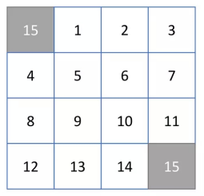
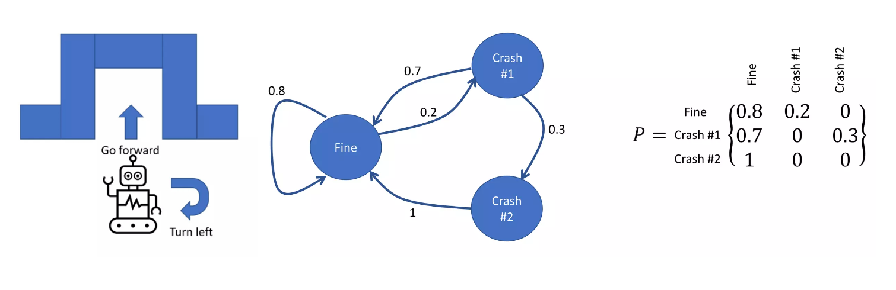

import ColorText from '@contents/components/ColorText';

공부를 시작하기에 앞서 먼저 우리가 해결해야 할 문제에 대해 목표를 정하고 가봅시다.
`Path-Finding In Grid` 라는 문제를 풀어보려고 합니다.

먼저 회색이 아닌 랜덤한 셀에서 시작하여 회색인 셀로 도달하는 경로를 찾으려고 합니다.
각 Action은 위, 아래, 왼쪽, 오른쪽 이동이 전부이고요.
목표에 도달하기 위한 Policy를 찾는 것이 우리의 목적이죠.

# MDP(Markov Decision Process)

`MDP`는 상태 $S_t$, 확률 밀도 함수 $P$, 보상 함수 $r(S_t, a_t)$로 이루어진 모델입니다.
순차적으로 행동을 결정해야 하는 문제를 풀기 위한 수학 모델이죠.
거의 모든 퍼즐 문제를 이를 활용하여 풀 수 있어요!

위 그림과 같이 Agent가 길을 찾는 작업을 수행한다고 할 때, 해당 작업에 대한 State와 State의 관계를 오른쪽 그림과 같이 정의할 수 있습니다.
여기서는 State와 State 사이 가중치를 가지는 관계를 형성하고 있죠.
이를 Transition Matrix로 표현할 수도 있어요.

$$
p_{ij} = P(S_{t+1} = s_j | S_t = s_i) \tag{1}
$$

$$
P(S_{t+1} = s_j) = \sum_{i=1}^{n} P(S_t = s_i) \cdot p_{ij} \tag{2}
$$

식 (1)과 같이 $t$ 시점에서 $s_i$에서 $s_j$로 가는 확률을 $p_{ij}$라고 한다면, 식 (2)와 같이 $t+1$ 시점에서 $s_j$에 도달할 확률은 앞선 State들에 대한 기대값의 합이라고 할 수 있습니다.
물론 <ColorText color='var(--error)'>확률 밀도 함수 $P$에 대한 정보를 가지고 있어야 하기 떄문에 환경을 완전히 관찰할 수 있어야 한다는 조건</ColorText>이 필요합니다.

각 상태와 확률 분포$(S, P, R, \gamma)$에 대한 가치 평가는 다음과 같이 이루어집니다.
$$
r(s_i) = E[R_{t+1}|S_t = s_i]
$$

