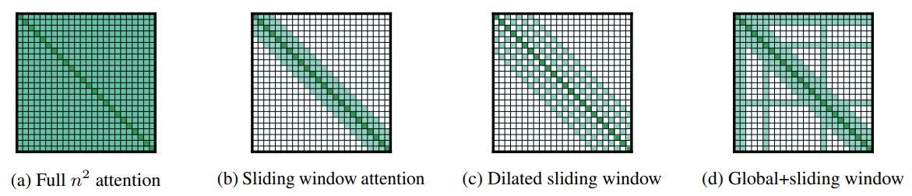
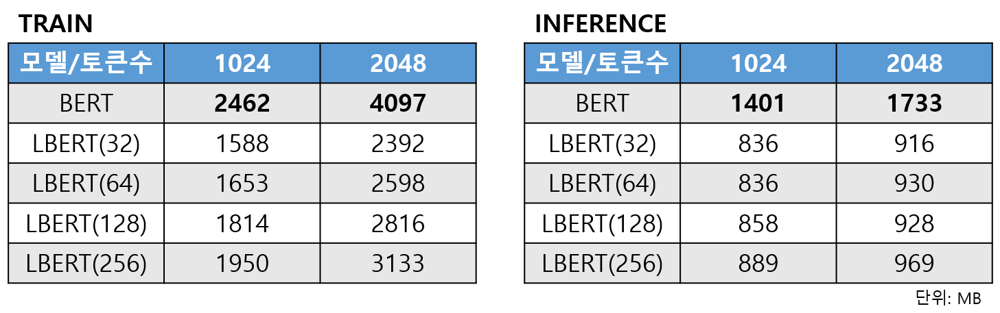

import Comment from '@contents/components/Comment';
import ColorText from '@contents/components/ColorText';

기사의 제목과 내용을 보고 낚시성 기사 여부를 판단하는 모듈을 개발합니다.

# Base 모델 선정

높은 한국어 인식율을 위해 한국어 문장으로 pre-trained 모델을 찾아보았어요. 

* [skt/kobert-base-v1](https://github.com/SKTBrain/KoBERT)  
SKT에서 제공하는 KoBERT는 의존성을 추가로 설치해야해서 다른 모델을 더 찾아보고 결정하기로 할게요.
* [monologg/kobert](https://huggingface.co/monologg/kobert)  
SKT KoBERT 다음으로 다운로드 수가 많은 모델이 huggingface에 있더라구요.
이를 사용하기로 합시다.

# 데이터 수집

우리는 기사의 제목과 내용을 보고 낚시성 여부를 판단하려고 합니다.
이에 뉴스 기사에 대한 내용과 제목을 크롤링하여 데이터로 만들 필요가 있어요.
하지만 모든 제목과 내용을 하나하나 비교하여 낚시성 여부를 판단 분류하는 것은 현실적으로 어려움이 있어요.
그래서 우리는 기사의 내용과 또 다른 기사의 제목을 사용하여 낚시성 기사를 생산해낼 생각입니다.


# Longformer 적용

학습을 진행하기 위해 뉴스 기사 내용을 토큰화하다 보니 최대 토큰 수를 넘어가는 일이 자주 발생하더라구요.
내용이 긴 뉴스에 대해 어느정도 내용의 손실이 발생하는 것입니다.
이를 해결하기 위해 BERT의 설정과 embedding layer를 어느정도 custom하여 최대 토큰 수를 늘리려고 하였으나 이는 메모리 사용량이 증가하다 보니 효율적이지 못한 것 같았아요.
그래서 여러가지 방법을 찾아보았습니다.



그 중 `Longformer`라는 모델이 긴 문서에 대한 처리를 가능하게 한다는 논문을 보았어요.
위 그림에서 (b), (c), (D) 처럼 3 가지 테크닉을 사용하여 기존의 fully self-attention을 조금 변형하여 적은 메모리를 사용하고도 효과적인 성능을 내는 원리입니다.
최대 토큰 수가 4096이라 하여 기사 내용을 토큰화 하기엔 충분한 것 같았어요.
하지만 한국어로 pre-trained된 모델이 없어 fine-tuning을 해도 기존보다 더 좋은 성능을 낼 수 있을지 의문이 들었어요.
그래서 이미 한국어로 pre-trained된 KoBERT 모델에 Longformer의 self-attention을 적용하는 방향을 생각하였습니다.

<Comment>
BERT 모델의 최대 토큰 수는 512 입니다.
</Comment>

먼저 huggingface에 이미 구현되어 있는 LongformerSelfAttention를 이용하여 BERT에 적용하려고 해요.
BertSelfAttention와 LongformerSelfAttention의 input이 차이가 있기 때문에 LongformerSelfAttentionForBERT 선언해 적절한 input으로 맞춰줍시다.

```python
class LongBertSelfAttention(nn.Module):
    def __init__(self, config, layer_id):
        super().__init__()
        self.long_self_attn = LongformerSelfAttention(config, layer_id=layer_id)
        
    def forward(
        self,
        hidden_states: torch.Tensor,
        attention_mask: Optional[torch.FloatTensor] = None,
        head_mask: Optional[torch.FloatTensor] = None,
        encoder_hidden_states: Optional[torch.FloatTensor] = None,
        encoder_attention_mask: Optional[torch.FloatTensor] = None,
        past_key_value: Optional[Tuple[Tuple[torch.FloatTensor]]] = None,
        output_attentions: Optional[bool] = False,
    ):

        # bs x seq_len x seq_len -> bs x seq_len 으로 변경
        batch_size, seq_len, _ = hidden_states.size()
        # attention_mask = attention_mask.squeeze()
        attention_mask = attention_mask.view(batch_size, seq_len)

        is_index_masked = attention_mask < 0
        is_index_global_attn = attention_mask > 0
        is_global_attn = is_index_global_attn.flatten().any().item()

        outputs = self.long_self_attn(
            hidden_states,
            attention_mask=attention_mask,
            layer_head_mask=None,
            is_index_masked=is_index_masked,
            is_index_global_attn=is_index_global_attn,
            is_global_attn=is_global_attn,
            output_attentions=output_attentions,
        )

        return outputs
```

is_index_masked, is_index_global_attn, is_global_attn 는 나중에 정리

또 우리가 수정한 모델에 대해 huggingface에 업로드하고 나중에 불러올 수 있도록 하기 위해 모델에 대한 class를 정의해줍시다.
```python
class LongBertForSequenceClassification(BertForSequenceClassification):
    def __init__(self, config):
        super().__init__(config)
        for i, layer in enumerate(self.bert.encoder.layer):
            layer.attention.self = LongBertSelfAttention(config, layer_id=i)
```

자 이제 모델에 대해서 설정값을 수정하고 self attention 레이어를 변경해줄 차례에요.
먼저 BERT의 설정에서 최대 토큰 수를 변경하고 attention window의 크기를 설정해줍시다.
```python
max_token_size = 4096
config = model.config
config.max_position_embeddings = max_token_size
config.attention_window = [attention_window] * config.num_hidden_layers
```

이제 position embedding의 크기를 늘려줘야 해요.
기존에는 512가 최대이기 떄문에 position_embeddings의 weight이 (512, 768)의 형태로 되어 있을거예요.
우리는 이를 (max_token_size, 768)의 형태로 늘려주는 작업을 진행합니다.
그리고 position_ids 역시 0~511에서 0~(max_token_size - 1)로 범위를 늘려줘야 합니다.
```python
current_max_token_size = model.bert.embeddings.position_embeddings.weight.size(0)
num_repeats = math.ceil(max_token_size / current_max_token_size)
embed_weight = model.bert.embeddings.position_embeddings.weight.data
embed_weight = embed_weight.repeat(num_repeats, 1)[:max_token_size,:]
model.bert.embeddings.position_embeddings.weight.data = embed_weight
model.bert.embeddings.position_ids.data = torch.arange(0,max_token_size).view(1, -1)
```

<Comment>
이때 조심해야 해요. RoBERTa와 같이 positional_ids 에서 0, 1을 특별한 용도로 사용하기 위한 모델도 있기 때문입니다.
잘 조사해보고 변경해야겠죠?
</Comment>

이제 self attention 레이어를 변경해줍시다.
Longformer의 self attention은 query, key, value뿐 아니라 query_global, key_global, value_global이 있습니다.
각각 기존 BERT의 query, key, value와 동일한 값을 가지도록 만들어 줍시다.
```python
for i, layer in enumerate(model.bert.encoder.layer):
    long_bert_self_attn = LongBertSelfAttention(config, layer_id=i)
    long_bert_self_attn.long_self_attn.query = layer.attention.self.query
    long_bert_self_attn.long_self_attn.key = layer.attention.self.key
    long_bert_self_attn.long_self_attn.value = layer.attention.self.value
    long_bert_self_attn.long_self_attn.query_global = copy.deepcopy(layer.attention.self.query)
    long_bert_self_attn.long_self_attn.key_global = copy.deepcopy(layer.attention.self.key)
    long_bert_self_attn.long_self_attn.value_global = copy.deepcopy(layer.attention.self.value)
    layer.attention.self = long_bert_self_attn
```

단순히 기존 BERT모델의 max token과 embedding만 늘렸을 때와
Longformer의 self-attention 방식을 적용하였을 때 메모리 사용량 차이를 비교해 볼게요.
동일한 길이의 토큰을 이용하고, LongBERT의 경우 다양한 attention window을 설정하여 테스트를 진행하겠습니다.



기존의 BERT 모델에 비해 LongBERT의 경우 학습, 추론시 모두 더 적은 메모리 용량을 사용하는 것을 볼 수 있습니다.
또한 최대 토큰수 증가에 따른 메모리 사용량이 기존 BERT에 비해 LongBERT가 더 적은 폭으로 증가하는 것을 확인할 수 있어요.
즉, 문서의 길이가 길면 길수록 LongBERT를 이용하여 더 효율적으로 학습과 추론을 수행할 수 있겠어요.
