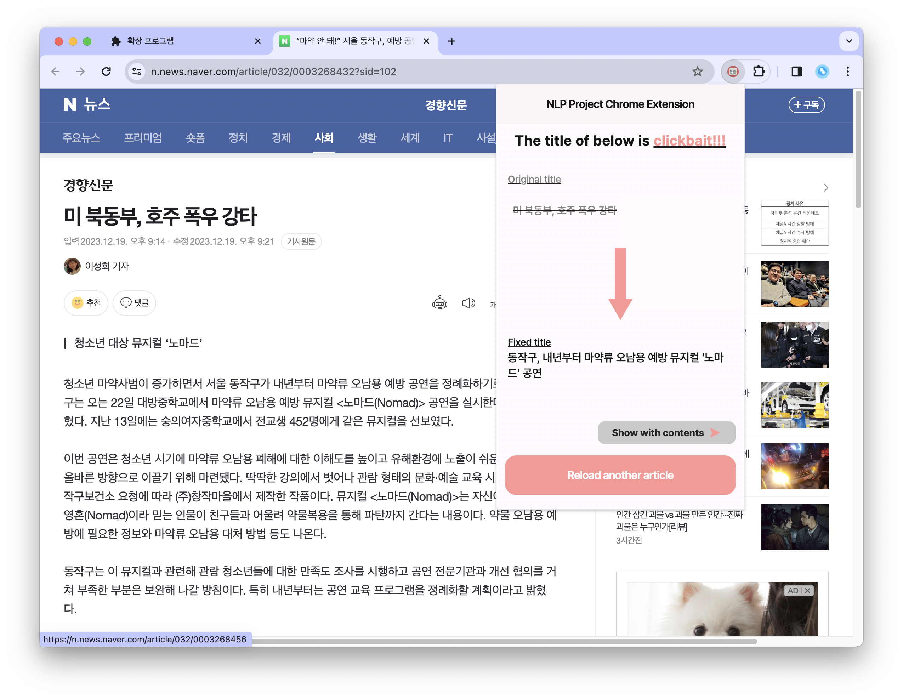
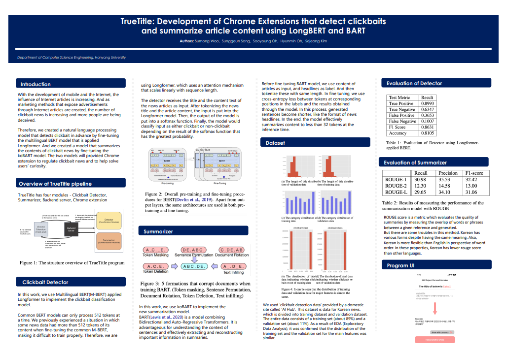

import Project from '@contents/components/Project';
import TwoCols from '@contents/components/TwoCols';
import Cols from '@contents/components/Cols';
import ColorText from '@contents/components/ColorText';

<Project
    members="AI 2명 | 백엔드 2명 | 프론트 1명"
    domain={['LLM']}
    roles={['Research', "Implementation"]}
    tools={['Pytorch']}
    schedule='23년 11월 2일 ~ 23년 12월 18일'
/>

___

> 한양대학교 자연어처리 수업에서 LLM을 이용한 팀 프로젝트를 진행하려 합니다.

# 🚩 프로젝트 목표

낚시성 기사를 탐지하여 내용과 일치하는 제목을 생성하는 프로젝트  

# ✏️ 개발 내용

<TwoCols>
<Cols size={50}>
### 🧩 모듈
1. 낚시성 기사 탐지 모듈 - Clickbait Detector  
기사의 제목과 내용을 함께 임베딩하여 `BERT` 모델을 활용해 두 내용 사이 차이가 존재하면 낚시성 기사로 분류하는 모델을 구현합니다.

2. 제목 생성 모듈 - Headline Creator  
기사의 내용을 이용하여 `BART` 모델을 활용해 새로운 제목을 생성하는 모델을 구현합니다. 
</Cols>

<Cols size={50}>
### 💡 이슈

<ColorText color='var(--error)'>
BERT의 최대 토큰 사이즈 512를 넘어가는 기사 내용이 다수 존재하여 내용의 일부가 누락되는 경우가 발생 

더 긴 문서를 다룰 수 있는 `Longformer`는 한국어로 사전 학습된 모델이 존재하지 않음
</ColorText>

<ColorText color='var(--info)'>
`Longformer`의 self-attention mechanism을 `KoBERT`에 적용시킨 `LongBERT`를 구현하여 메모리의 증가량을 최소화 하며 
**<u>최대 8배</u>** 더 긴 한글 문서에 대해 대응할 수 있도록 해결
</ColorText>

</Cols>
</TwoCols>

# 📷 결과

<TwoCols align='center'>
<Cols size={50}>

</Cols>
<Cols size={50}>
앞서 구현한 모델을 간단하게 테스트해볼 수 있도록 구축된 서버와 REST API를 사용하여 통신할 수 있는 Chrome 확장프로그램으로 프로토타입을 만들었습니다.

이를 네이버 뉴스에서 뉴스 기사 하나를 선택하고 개발자 도구를 활용하여 내용과 상관 없는 제목으로 변경 후 확장프로그램을 통해 테스트를 진행하였습니다.

내용과 알맞은 뉴스 기사를 생성하는 것을 볼 수 있었습니다.
</Cols>
</TwoCols>

# 🤔 느낀점

그간 단순히 LLM을 불러오고 fine-tuning을 통한 downstream task에 적합하도록 학습시키는 것과 다르게
모델의 필요한 부분을 수정하기 위해 구조를 더 자세히 공부하는 계기가 되었습니다.
하지만 프로젝트 기간이 짧아 성능을 개선할 수 있는 여러 방법에 대해 테스트를 진행하지 못해 아쉬웠다.

* 학습 데이터 개선의 여지  
모델 학습을 A기사 내용과 B기사 제목을 결합하는 방식으로 낚시성 기사 데이터를 생성하였다.
이를 활용하여 학습을 진행하였을 때 아예 다른 내용의 제목을 가지는 경우 낚시성 기사라고 잘 판단하였다.
하지만 비슷한 단어를 사용하지만 내용과 전혀 반대되는 경우에는 아쉬운 정확도를 갖추었다.
이를 해결하기 위해 기존 방식에 더해 A기사 내용과 A기사 제목의 일부 단어를 추가, 제거 혹은 변경하는 augmentation을 진행하면 더 좋은 결과가 나올 수 있었을 것 같다.

* 모델 구조 개선의 여지  
낚시성 기사를 탐지하고 제목을 생성하는 모듈을 활용하여 해당 프로젝트를 구현하였다.
하지만 일단 내용을 통해 제목을 생성한 후 기존 제목과 비교하는 형식으로 낚시성 여부를 판단해도 될 것 같다.
또 공부를 위해 직접 생성형 모델을 학습시켰지만, GPT와 같은 더 큰 규모를 가진 모델의 API를 사용하여 처리 하는 것으로 더 높은 성능을 낼 수 있다.
위 방식이 모두 테스트되어 가장 높은 성능을 가진 구조를 채택하는 것이 좋았겠지만 짧은 시간으로 진행할 수 없어 아쉬웠다.

* `LongBERT` 검증 필요성  
`Longformer`의 self-attention을 `BERT`에 적용하여 구현할때 기존 `BERT`의 embedding을 필요한 크기만큼 증가시켰다.
이때 기존 embedding을 그대로 복사하여 확장된 embedding에 적용하는 방식을 선택하였다.
물론 fine-tuning을 통해 어느 정도 학습을 하였지만, 확장된 embedding 부분에 해당하는 토큰들 역시 충분히 고려되고 있는지 검증할 필요가 있었다.
하지만 아쉽게도 짧은 시간으로 이를 검증할 수 없었다.

